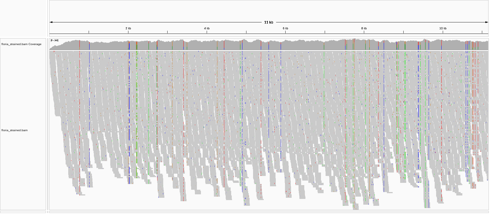
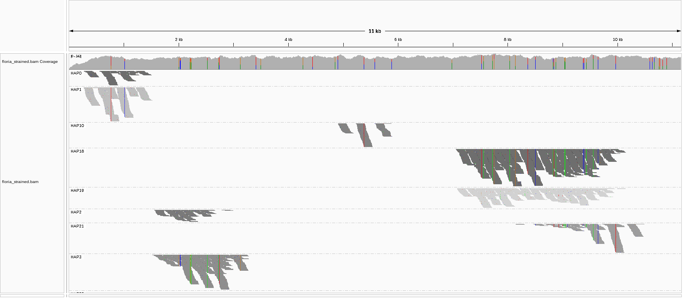
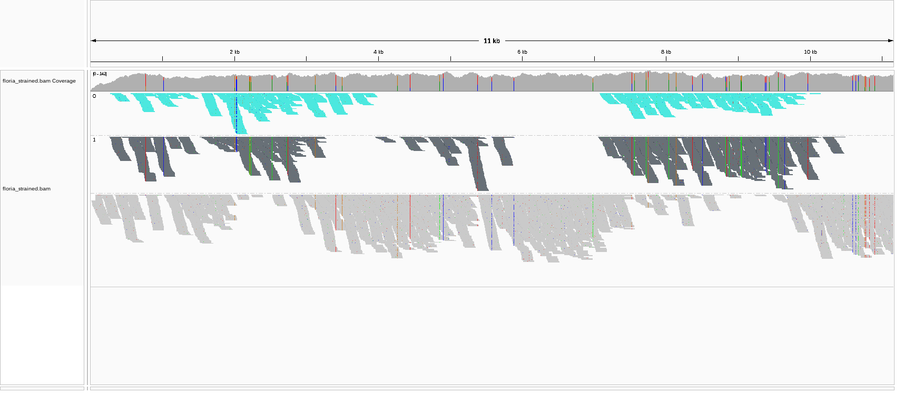

<p align="center">
    <a href="https://github.com/maxibor/floria-strainer/actions/workflows/ci.yaml/badge.svg"></a>
    <br>
   
</p>

---

**floria-strainer**: strains out genomes from [floria](https://github.com/bluenote-1577/floria).

## Introduction

Given the output of the strain haplotyping software [floria](https://github.com/bluenote-1577/floria)[^1] , **floria-strainer** computes the allele frequency at each variable position of each haploset identified by floria to cluster them into the different strains composing the mixture, using a Gaussian Mixture Model. 

## Install

```bash
pip install git+https://github.com/maxibor/floria-strainer.git
```

## Quick start

Running floria-strainer on the provided test data

```bash
$ floria-strainer -b tests/data/test_short.bam tests/data/floria_out_dir
INFO - Writing the straining informations to floria_strained.strained.csv.
INFO - 2 strains were found: 0, 1
INFO - Writing the BAM file in tag mode to floria_strained.bam.
```

## Visualizing the strain clustering

floria-strainer takes the output of floria-strainer, with reads having been assigned to a haploset (fig 2). Based on the average allele frequency of each haploset, reads are clustered in the different strains. In this example (fig 3), there are two strains of minor and major allele frequency, which floria-strainer clustered in strain 0 and strain 1.
Reads that weren't assigned to any haploset by floria, or whose haploset do not cluster well enough are not assigned to any strain. They are considered to be shared by the different strains present in the alignment.

  

Fig 1: Reads aligned to the reference genome, visualized in IGV. The top track represents the reference genome, with variants indicated in the different colors.

  

Fig 2: Reads are grouped and colored by the `HP` **HaPloset** tag as annotated by Floria.

  

Fig 3: Reads are grouped and colored by the `ST` **STrain** tag as annotated by floria-strainer.

## Help

```bash
$ floria-strainer --help
                                                                                                                                                                            
 Usage: floria-strainer [OPTIONS] FLORIA_OUTDIR                                                                                                                             
                                                                                                                                                                            
 Strain the haplotypes in the floria output directory.                                                                                                                      
 Author: Maxime Borry                                                                                                                                                       
                                                                                                                                                                            
╭─ Options ────────────────────────────────────────────────────────────────────────────────────────────────────────────────────────────────────────────────────────────────╮
│    --version                      Show the version and exit.                                                                                                             │
│    --nb-strains  -n  INTEGER      Number of strains to keep. If 0, the number of strains will be determined by the mean floria average strain count with HAPQ > 15.      │
│                                   [default: 0]                                                                                                                           │
│    --hapq-cut    -h  INTEGER      Minimum HAPQ threshold [default: 15]                                                                                                   │
│    --sp-cut      -s  FLOAT        Minimum strain clustering probability threshold [default: 0.5]                                                                         │
│ *  --bam         -b  PATH         Input BAM file [required]                                                                                                              │
│    --mode        -m  [tag|split]  BAM output mode. Tag: add ST (strain) tags to the reads. Split: split the reads in different BAM files per strain. [default: tag]      │
│ *  --basename    -o  TEXT         Output file basanem [default: floria_strained] [required]                                                                              │
│    --help                         Show this message and exit.                                                                                                            │
╰──────────────────────────────────────────────────────────────────────────────────────────────────────────────────────────────────────────────────────────────────────────╯
```

## Tests

```bash
$ pip install poetry pytest
$ poetry run pytest -vv
```

[^1]: [Floria: Fast and accurate strain haplotyping in metagenomes](https://www.biorxiv.org/content/10.1101/2024.01.28.577669v1.full) 